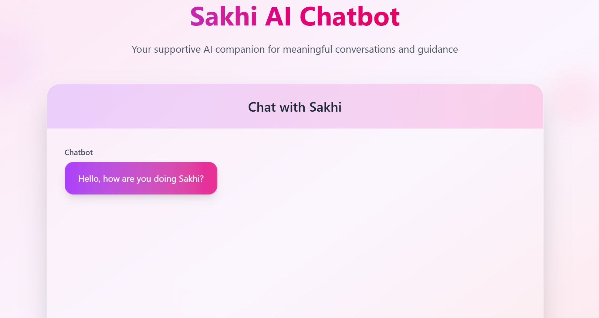

# 🌸 Mission Sakhi

Mission Sakhi is more than just a social platform—it's a safe and secure space where women can connect, share, and find support without the harassment and toxicity often found on mainstream platforms. Our goal is to empower women by providing a truly safe environment for open and honest communication.

---

## ✨ Features

* **📝 Secure Report Filing:** A system that allows users to securely file complaints, which are then reviewed by platform administrators.
* **🕊 Anonymous Forums:** Share stories and opinions without revealing your identity, fostering a sense of psychological safety.
* **💬 Real-Time Community Chats:** Engage in live conversations within themed groups, covering topics like safety, relationships, and general support.
* **🚫 Robust User Moderation:** A system for user reporting and temporary bans to keep the community free from harassment and abuse.
* **🔐 Secure Authentication:** A JWT-powered login and signup system to protect user accounts and data.
* **🎨 Modern and Responsive UI:** A clean, minimal, and mobile-friendly design for a seamless user experience.
* **⚡ Scalable Backend:** Built to handle a growing user base with a powerful and efficient tech stack.
* **🛡 Advanced Content Moderation:** Integration with the **Perspective AI API** to detect and prevent hate speech, harassment, and other abusive content from being posted.

---

## 🖼️ Screenshots

<div align="center">

  

  <br><br>

  

  <br><br>

  &nbsp;&nbsp;
  

  <br><br>

  

</div>

---

## 🛠️ Tech Stack

**Frontend**
* **⚛️ React.js:** The core library for building the user interface.
* **🎨 TailwindCSS:** A utility-first CSS framework for rapid styling.
* **🌐 Context API & Styled Components:** For state management and component-based styling.

**Backend**
* **🟢 Node.js + Express:** The runtime environment and framework for the server-side logic.
* **📦 MongoDB (Mongoose ORM):** The NoSQL database for storing application data.
* **🔐 JWT Authentication:** For secure, token-based user authentication.
* **💬 Socket.IO:** Enables real-time, bidirectional communication for the chat feature.
* **🛡 Perspective AI API:** A powerful tool for content moderation and detection of harmful language.

**Cloud & Tools**
* **☁️ Cloudinary:** For managing and hosting user profile images and other uploads.
* **🛡️ Secure API Architecture:** Designed with security best practices in mind.

---

## ⚡ Getting Started

To get a local copy up and running, follow these simple steps.

1.  **Clone the Repository**
    ```bash
    git clone [https://github.com/your-username/MissionSakhi.git](https://github.com/your-username/MissionSakhi.git)
    cd MissionSakhi
    ```
2.  **Install Dependencies**
    ```bash
    npm install
    ```
3.  **Configure Environment Variables**
    Create a `.env` file in the root directory and add the following:
    ```env
    MONGO_URI=your_mongodb_connection_string
    JWT_SECRET=your_secret_key
    CLOUDINARY_CLOUD_NAME=xxx
    CLOUDINARY_API_KEY=xxx
    CLOUDINARY_API_SECRET=xxx
    ```
4.  **Run Locally**
    * **Backend**
        ```bash
        cd backend && npm run dev
        ```
    * **Frontend**
        ```bash
        cd frontend && npm start
        ```

---

## 🤝 Contributing

Contributions are what make the open-source community such an amazing place to learn, inspire, and create. Any contributions you make are **greatly appreciated**.

1.  Fork the Project
2.  Create your Feature Branch (`git checkout -b feature/AmazingFeature`)
3.  Commit your Changes (`git commit -m 'Add some AmazingFeature'`)
4.  Push to the Branch (`git push origin feature/AmazingFeature`)
5.  Open a Pull Request

---

## 🙏 Acknowledgements

This project is built with ❤️ to empower women and ensure safety online.
A huge thanks to everyone who has supported and contributed to Mission Sakhi. 🌸
